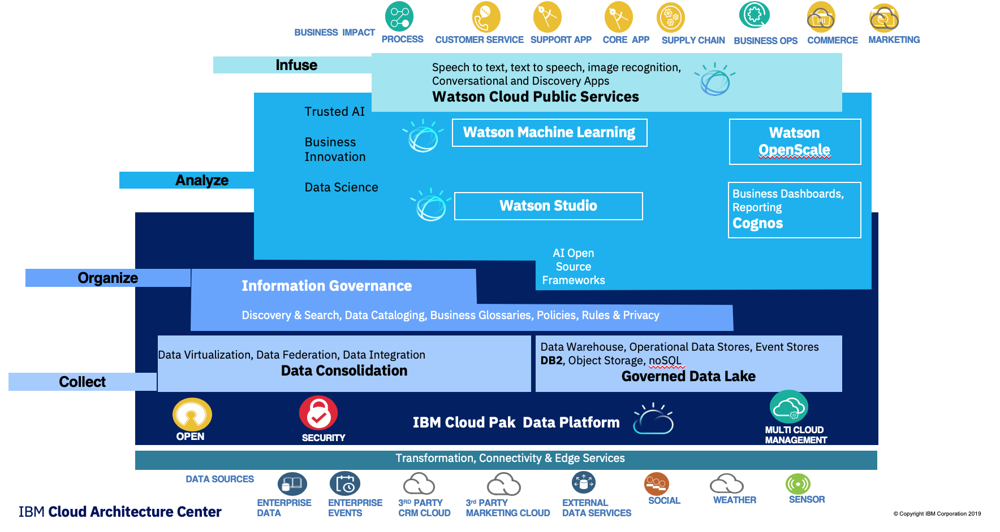

# Data and AI Reference Architecture

!!! abstract
    This git repository is the sandbox to share best practices to develop Data and AI intensive applications or  *Intelligent applications*. When content is mature it is move to IBM Garage architecture center. You can read the current currated content in [Data, Analytics and AI reference architecture](https://www.ibm.com/cloud/garage/architectures/dataAIArchitecture).

As we look to methodology for developing such solutions we need to consider a prescriptive approach  which brings  those project stakeholders together to be successful.  To do this we adopt a four layers approach:

* **[COLLECT](#collect-making-data-simple-and-accessible)** data to make them easier to consume and accessible
* **[ORGANIZE](#organize-trusted-governed-analytics)** data to create a trusted analytics foundation on data with business meaning
* **[ANALYZE](#analyze-insights-on-demand)** to scale business insight with AI everywhere
* **[INFUSE](#infuse-operationalize-ai-with-trust-and-transparency)** to operationalize AI with trust and transparency

The figure below represents how those layers are related to each other:

    Figure 1: AI Ladder

## IBM Data and AI Conceptual Architecture

Based on the above prescriptive approach, we cans see that a Data centric and AI reference architecture needs to implement the four layers as shown in the following diagram.

    Figure 2: High level view of the Data & AI reference architecture

This architecture diagram illustrates:

1. strong data collection and management capabilities,
1. inside a 'multi cloud data platform' (dark blue area),
1. on which AI capabilities are plugged in to support analysis done by data scientists (machine learning workbench and business analytics) and build models
1. that are consumed by business applications to become more 'intelligent'. Those applications can also consume pre-built model like speech recognition and MLUnderstanding.

The data platform addresses the data **collection** and **transformation** tasks to move data to a cloud or local highly scalable data **store**.

However we must also recognise that there are cases, where data movement can or must be avoided. For examples where:

* no transformations necessary (e.g. accessing an external data mart via SQL or API)
* no performance impact (e.g. materialized SQL views served by a parallel database backend)
* regulatory aspects (each reach access to a data source must be logged to an audit log)
* real-time aspects (data must be processed immediately, latency of storage too high)
* size (data movement too expensive from a network bandwith perspective, **compute** must move toward data source)
* privacy (data can't be copied, only aggregates as a result of **compute** can be moved)
* network partition (data source unreliable e.g. remote IoT Gateway)

In such cases the data platform provides a virtualization capability which can open a view on remote data sources without moving data.

In **Analyze** data scientists need to perform:

* **[data analysis](./preparation/data-understanding.md)**, which includes making sense of the data using data **visualization**.
* **[feature engineering](./preparation/#feature-engineering)** to define the features they need to build an ML model.

Then to **[build the model](http://localhost:8000/preparation/dev-model/)**, the development environment provides the AI frameworks and helps the data scientists to select and combine the different algorithms and to tune the hyper parameters.

The model training can be done on local cluster or can be executed, at the big data scale level, to a machine learning cluster.

Once the model provides acceptable accuracy level, it can be published so that it can be consumed or *infused* within an application or exposed as a service or as an autonomous agent.

The model management capability supports the meta-data definition and the life cycle management of the model (data lineage).

Once the model is deployed, **monitoring** capabilities, ensures the model is still accurate and
not biased.

The **intelligent application**, is represented as a combination of capabilities at the top of the diagram, it can be an application we develop, a business process, an ERP or CRM application, etc.  running anywhere on cloud, fog, or mist computing.

The intelligent application, accesses the deployed model, APIs, and may consumes pre-built models or Cognitive services, such as:  

* **speech to text and text to speech** services  
* **image recognition**, a **tone analyzer** services
* **NLU** Natural Language Understanding and chatbot services.

## Data and AI reference architecture capabilities

In the view below of the reference architecture we have zoomed in a level to show the detail of how we realize the required capabilities.

    Figure 3: High level view of the Data and AI reference architecture

This diagram becomes the foundation of  the *Data and AI reference architecture*  but can built incrementally as explain in [this section](http://localhost:8000/architecture/#defining-the-architecture-incrementally).

* [Data collection and organization](architecture/collect-org-data.md)
* [AI model development](architecture/build-model.md)
* [Application runtime](architecture/runtime-flow.md)

## Mapping to products

IBM is offering a comprehensive suite of products to support the above capabilities, the following diagram illustrates the product mapping:

