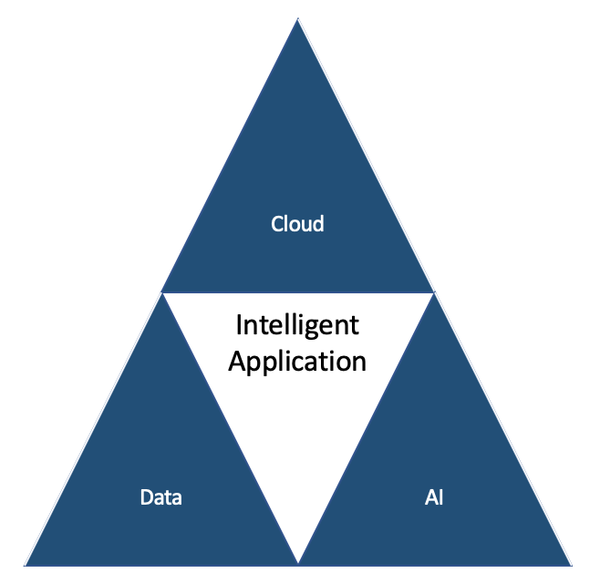

# Data - AI - Analytics Reference Architecture

In this reference architecture, we are focusing on defining architecture patterns and best practices to build data and AI intensive applications. We are addressing how to integrate data governance, machine learning practices and the full life cycle of a cloud native solution development under the same reference architecture to present and holistic point of view on how to do it.

# Principles

1. There is a spectrum from single source of the truth to data hyper personalisation . Fundamentally we need to embrace the fact that different roles need specialised data stores with redundancy and replication between them Exercise specialisation through connectivity
2. Different application patterns apply different data specialisation.
1. There is a clear dependency between AI and Data management, but for an intelligent application context there are a Data concern, a AI model management concern, a multi cloud deployment concerns.
  

3. As you constrain scalability and network connectivity you also constrain data store, data structure and data access    
4. The value and way of storing and representing data may change with its age. Value also comes in the recognition of patterns in the time series.

# Patterns

## Data platform

## Intelligent application

## Business intelligence

## Stream analytics

# Data is fundamental

What makes managing data so challenging and complex is that, by itself, data doesn't do anything. Data is inert; it is not self-organizing or even self-understanding. In the DIKW pyramid, data is the base with the least amount of perceived usefulness. Information has higher value than data, knowledge has higher value than information, and wisdom has the highest perceived value of all. Data requires something else—a program, a machine, or even a person—to move up the value chain and become information.

The IBM AI Ladder also begins with data. You get higher business value when you perform business-assisted functions such as analytics, machine learning, or artificial intelligence on top of the data.
