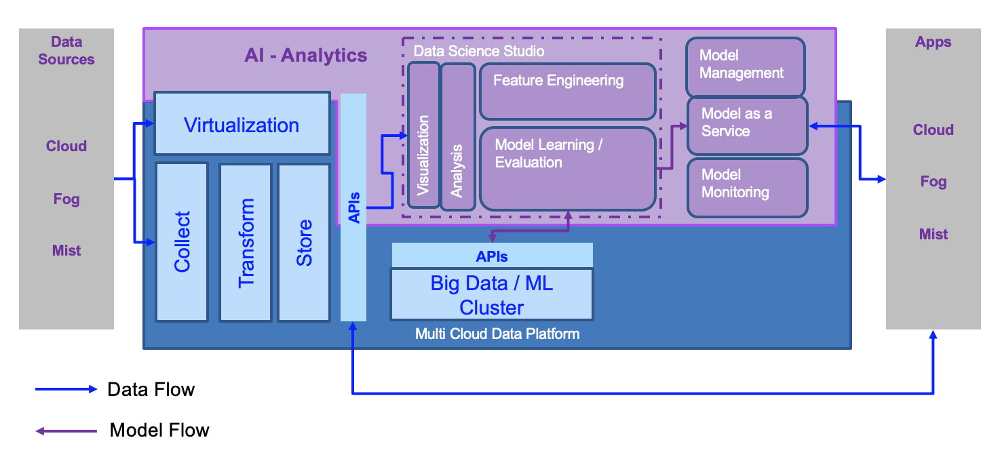

# Data - AI - Analytics Reference Architecture

!!! abstract
    In this reference architecture, we are focusing on defining architecture patterns and best practices to build data and AI intensive applications. We are addressing how to integrate data governance, machine learning practices and the full life cycle of a cloud native solution development under the same reference architecture to present a holistic point of view on how to do it.

When we consider development of  Data and AI intensive applications  or  *intelligent Application*  it is helpful to think of how the combination of three underlying architecture patterns

+ Cloud Native application architecture patterns
+ Data architecture patterns
+ AI architecture patterns

provides the right foundation to enable us to develop these *intelligent applications* in a highly agile cloud native way.

By considering the nature of joins between the architectures we can also understand how the different roles such as Software Engineer, Data Engineer, and Data Scientist relate and work together in the development of such solutions.

The following diagram illustrates the top-level view of a Data centric and AI reference architecture. There is no argument about it, AI without Data will not exist. The architecture illustrates the need for strong data management capabilities inside a 'data platform', on which AI capabilities are plugged in.

The data platform addresses the data **collection** and **transformation** to move data to local highly scalable **store**. Sometime, it is necessary to avoid moving data when there is no need to do transformations or no performance impact to the data sources by adding readers, so a virtualization capability is necessary to open a view on remote data sources. 
On the AI side, data scientists need to perform data **analysis**, which includes making sense of the data using data **visualization**. To build a model they need to define features, and the AI environment supports **feature engineering**. Then to build the model, the development environment helps to select and combine the different algorithms and to tune the hyper parameters. The execution can be done on local cluster or can be executed, at the big data scale level, to **machine learning cluster**.

Once the model provides acceptable accuracy level, it can be published as a service. The model management capability supports the meta-data definition and the life cycle management of the model. When the model is deployed, **monitoring** capability, ensures the model is still accurate and even not biased. 

The intelligent application on the right side, can run on cloud, fog, or mist. It accesses the deployed model, access Data using APIs, and even consumes pre-built models, congitive services, like a **speech to text and text to speech** service, an **image recognition**, a **tone analyzer** services, the Natural Language Understanding (**NLU**), and **chatbot**. 

# Data is fundamental

Managing data within the enterprise has proven to be challenging and complex. By itself data doesn't do anything. To make data useful, something other than the data is required – such as a computer program, a query, or a user (machine or person). Data is inert; it is not self-organizing or even self-understanding. This is what contributes to making data challenging and complex.

In the [DIKW pyramid](https://en.wikipedia.org/wiki/DIKW_pyramid), data is the base with the least amount of perceived usefulness. Information has higher value than data, knowledge has higher value than information, and wisdom has the highest perceived value of all. Data requires something else—a program, a machine, or even a person—to move up the value chain and become information. By organizing and classifying information, the value chain can begin and expand from data and information to be regarded as knowledge.

Wisdom, the top of the pyramid, is the pinnacle of the data value chain. Wisdom results in a combination of inert data – a fundamental raw material in the modern digital age – combined with a series of progressive traits such as: perspective, context, understanding, learning, and the ability to reason. Cognitive computing and artificial intelligence now mean that these traits can be attributed to both a person and a machine.

 

 The IBM AI Ladder loosely parallels the DIKW pyramid in that the AI Ladder represents a progressive movement towards value creation within an enterprise. Increased value can be gained from completing activities at each step of the AI Ladder, with the potential to recognize higher levels of value, the higher the ladder is climbed.

The AI Ladder contains four discrete levels: collect, organize, analyze, and infuse. Arguably, data lies below the first rung, recognizing the inert nature of data. The first rung is collect, a primitive action that serves as the first element towards making data actionable and to help drive automation, insights, optimization, and decision-making. Collect is an ability to attach to a data source – whether transient or persistent, real or virtual, and while being agnostic as to its actual location or its originating (underlying) technology.

The AI Ladder progresses through the rungs to infuse, a state of capability that means an enterprise has taken artificial intelligence beyond a science project. Infusion means that advanced analytical models have been interwoven into the essential fabric of an application or system whereby driving new or improved business capabilities.

## Data as a differentiator

Data needs to become treated as a corporate asset. Data has the power to transform any organization, add monetary value, and enable the workforce to accomplish extraordinary things. Data-driven cultures can realize higher business returns.

While a dog house can be built without much planning, you cannot build a modern skyscraper with the same approach. The scale of preserved data across a complex hybrid cloud or multi-cloud topology requires discipline, even for an organization that embraces agile and adaptive philosophies.

Data can and should be used to drive analytical insights. But what considerations and planning activities are required to enable the generation of insights, the ability to take action, and the courage to make decisions? Although the planning and implementation activities to maximize the usefulness of your data can require some deep thinking, organizations can become data-centric and data-driven in a short time.

More so than ever, businesses need to move rapidly. Organizations must respond to changing needs as quickly as possible or risk becoming irrelevant. This applies to both private or public organizations, whether large or small.

Data and the related analytics are key to differentiation, but traditional approaches are often ad hoc, naive, complex, difficult, and brittle. This can result in delays, business challenges, lost opportunities, and the rise of unauthorized projects.

## Data platform

### Principles

1. There is a spectrum from single source of the truth to data hyper personalisation . Fundamentally we need to embrace the fact that different roles need specialised data stores with redundancy and replication between them Exercise specialisation through connectivity
1. Different application patterns apply different data specialisation.
1. There is a clear dependency between AI and Data management, but for an intelligent application context there are a Data concern, a AI model management concern, a multi cloud deployment concerns.
1. As you constrain scalability and network connectivity you also constrain data store, data structure and data access.    
1. The value and way of storing and representing data may change with its age. Value also comes in the recognition of patterns in the time series.

Today, our users may have access to terabytes, petabytes, or even exabytes of data. But if that data is not collected, organized, managed, controlled, enriched, governed, measured, and analyzed, that data is not just useless, it can become a liability.

### Collect – Making Data Simple and Accessible

The first rung of the AI Ladder is collect and is how an enterprise can formally incorporate data into any analytic process. Data can be:

* Structured, semi-structured, unstructured
* Proprietary or open source
* In the cloud or on-premise
* Any of it or all of it

### Organize – Trusted, Governed Analytics

The second rung of the AI Ladder is organize and is how is an enterprise can make data known, discoverable, usable, and reusable. The ability to organize is prerequisite to becoming data-centric. Additionally, data of inferior quality or data that can be misleading to a machine or end-user can be governed so that any use can adequately controlled. Ideally, the outcome of organize is a body of data that is appropriately curated and offers the highest value to an enterprise. Organize allows data to be:

* A discoverable asset
* Cataloged
* Profiled, categorized, and classified
* Secured through policy-based enforcement
* A source of truth and utility

### Analyze – Insights On-Demand

The third rung of the AI Ladder is analyze and is how is an organization approaches becoming a data-driven enterprise. Analytics can be human-centered or machine-centered. In this regard the initials AI can be interpreted to mean Augmented Intelligence when used in a human-centered context and Artificial Intelligence when used in a machine-centered context. Analyze covers a span of techniques and capabilities from basic reporting and business intelligence to deep learning. Analyze allows data to be:

* Determine what has happened
* Determine what is happening
* Determine what might happen
* Compare against expectations
* Automate and optimize decisions

### Infuse – Operationalize AI with Trust and Transparency

The fourth rung of the AI Ladder is infuse and is how is an enterprise can use AI as a real-world capability. Operationalizing AI means that models can be adequately managed which means an inadequately performing model can be rapidly identified and replaced with another model or by some other means. Transparency infers that advanced analytics and AI are not in the realm of being a dark art and that all outcomes can be explained. Trust infers that all forms of fairness transcend the use of a model. Infuse allows data to be:

* Used for automation and optimization
* Part of a causal loop of action and feedback
* Exercised in a deployed model
* Used for developing insights and decision-making
* Beneficial to the data-driven organization
* Applied by the data-centric enterprise

## Towards Data-Centricity

Drivers for what causes change within a business can be regarded as being stochastic. Whether foreseen or randomly determined, each change is likely to require new data – data that an organization has not previously anticipated. Increased data volumes, increases in the number of data sources, increases to the rates of data ingestion, and increases in the variety of the types of data are nothing more than de facto a prioris. 

While users are likely to have access to terabytes, petabytes, or even exabytes of data from data streams, IOT-sensors, transactional systems, and so on, if the data is not properly incorporated, managed, controlled, enriched, governed, measured, and deployed then the data may not only become useless, the data may become a liability. 

The activities to properly handle data and to pursue the AI Ladder, can be shown in the three solution areas of IBM Data and AI offerings:

* [Hybrid Data Management](https://www.ibm.com/analytics/data-management)
    * Collect all types of data, structured and unstructured
    * Include all open sources of data
    * Single platform with a commonf application layer
    * Write once and deploy anywhere
* [Unified Governance and Integration](https://www.ibm.com/analytics/unified-governance-integration)
    * Satisfy all matters of finding, cataloging and masking data
    * Integrate fluid data sets
    * Deliver built-in compliance
    * Leverage advanced machine learning capabilities
* [Data Science](https://www.ibm.com/analytics/data-science) and [Business Analytics](https://www.ibm.com/analytics/business-analytics)
    * Deliver descriptive, prescriptive and predictive insights across all types of data
    * Enable advanced analytics and data science methods

## Making data enabled and active

There are five key tenets to making data enabled and active:

* Developing a data strategy
* Developing a data architecture
* Developing a data topology for analytics
* Developing an approach to unified governance
* Developing an approach to maximizing the accessibility of data consumption

If data is an enabler, then analytics can be considered one of the core capabilities that is being enabled.

Analytics can be a complex and involved discipline that encompasses a broad and diverse set of tools, methods, and techniques. One end of the IBM AI Ladder is enabled through data in a static format such as a pre-built report; the other end is enabled through deep-learning and advanced artificial intelligence. Between these two ends, the enablement methods include diagnostic analytics, machine learning, statistics, qualitative analysis, cognitive analysis, and more. A robot, a software interface, or a human may need to apply multiple techniques within a single task or across the role that they perform in driving insight, taking action, monitoring, and making decisions.

# Patterns

## Intelligent application

## Business intelligence

## Stream analytics
