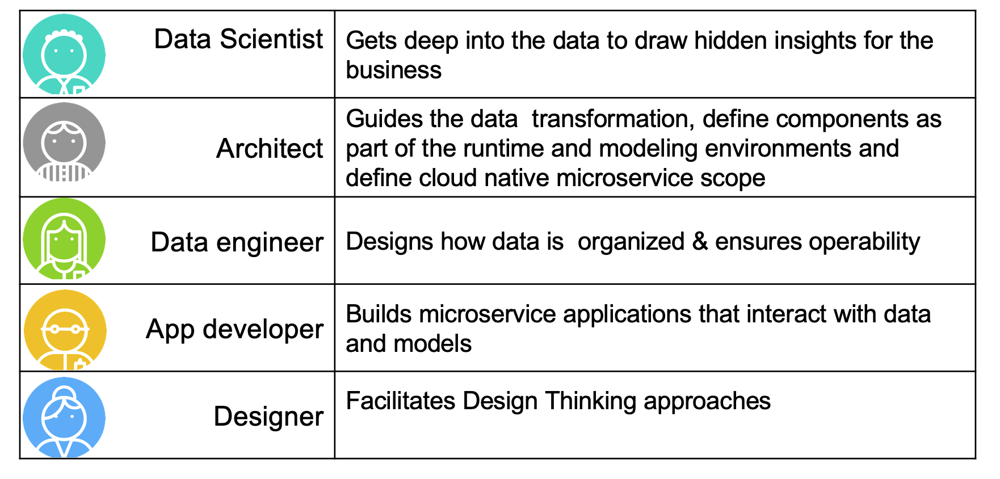
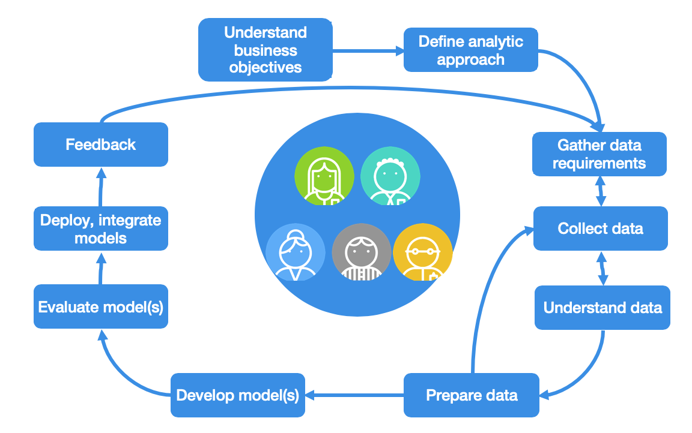
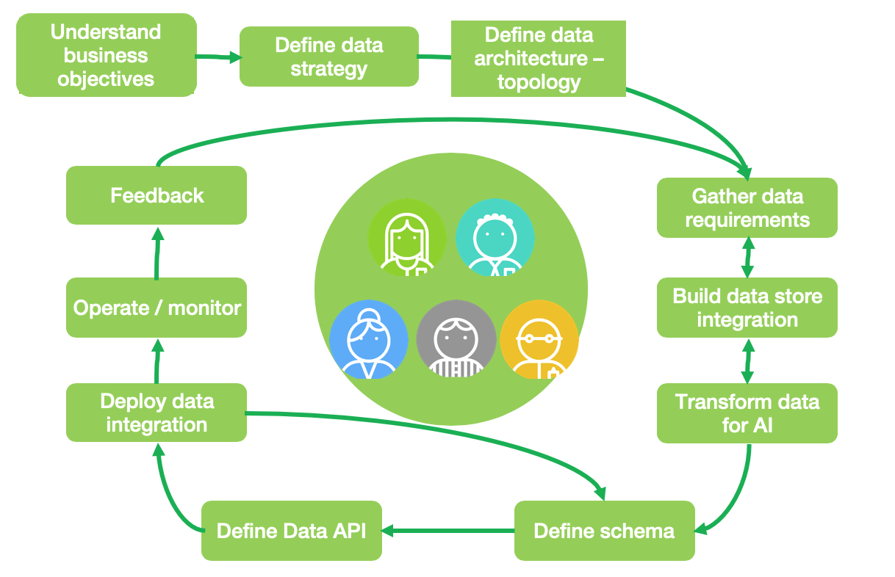
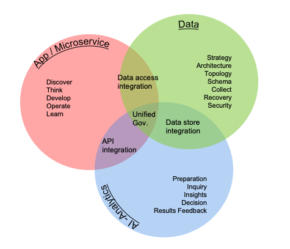
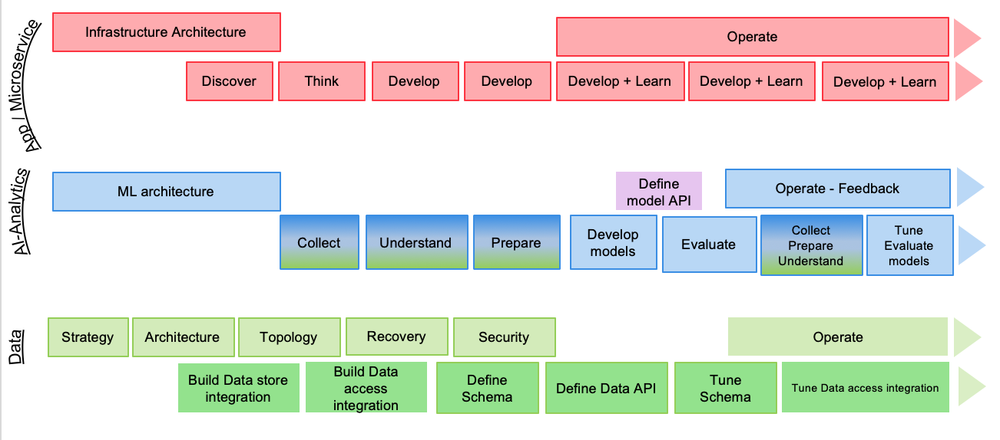

# Methodology

!!! warning
        UNDER CONSTRUCTION

!!! abstract
    In this section we are introducing the different elements of the software life cycles, particular to the development of intelligent applications that leverage data, machine learned models, analytics and cloud native microservices.

!!! This is a full fledged Enterprise Methodology addressing concerns of multinational data center deployments. For the purpose of MVP [(Minimum Viable Product)](https://en.wikipedia.org/wiki/Minimum_viable_product) creation we recommend to start with the [Lightweight IBM Cloud Garage Method for Data Science](lightweight.md) which one one hand is ideally suited for MVP / POC (Proof of Concept) work, on the other hand is compatible with the methodology described here so that scale-up is straightforward. This method always guarantees to have a deployable product at any point in time, a concept know if CICD (Continuous Integration, Continuous Delivery) and therefore is also compatible to such a software development process.

## Integrating data - devops and AI analytics methodologies

Most organizations need to manage software lifecycles. The key tenets listed above imply the need for a separate lifecycle for data, because the outcome or deliverable for any of the key tenets should not be considered static and immutable. Like data, you can think of analytics as having its own lifecycle independent from the software lifecycle and the data lifecycle, although they are all complementary.

To help achieve digital transformation, your organization should integrate three development lifecycles:

* Software/Application
* Analytics
* Data

Each development lifecycle is representative of an iterative workflow that can be used by agile development teams to craft higher value business outcomes. Lifecycles are often timeboxed iterations and can follow a fail-fast paradigm to realize tangible assets. Speed is important in business; most businesses work to meet new needs quickly. The objective of each lifecycle iteration is to address business speed efficiently and proficiently while maximizing business value. 

### Personas

Before going deeper into the different lifecycles, we need to define the personas involved in those lifecycles. The table below present the icons we are using in subsquent figures, with a short description for the role.

### Devops lifecycle

The software/application development lifecycle (SDLC) is a well-known and supports both traditional and agile development. The SDLC iterates on incorporating business requirements, adopt test driven development, continuous deployment and continuous integration. The diagram below demonstrates the iteration over recurring developer tasks to build the business intelligent application (internal loop), and the release loop to continuously deliver application features to production (bigger loop).    

!!! notes
    Before entering the development iteration cycles, there are tasks to scope the high level business challenges and opportunities, define the business case for the project, define and build the development and operation strategy, define the target infrastructure, security... The smaller loop represents development iteration, while the outer loop represents software release to production with continous feedback to monitor and assess features acceptance. This task list is not exhaustive, but represents a common ground for our discussion.

### AIOps lifecycle

The ai-analytics development lifecycle (ADLC) supports the full spectrum of analytical work in the artificial intelligence ladder. This lifecycle incorporates model development and remediation to avoid drift. Because one of the purposes of analytics is to enable an action or a decision, the ADLC relies on feedback mechanisms to help enhance machine models and the overall analytical environment. 

An example of a feedback mechanism is capturing data points on the positive or negative effects or outcomes from an action or a decision. The ADLC iterates on data. 

!!! notes
    The developed AI or Analytics model is deployed as one to many services that are integrated in the microservice architecture. So synchronization with devops team is important and part of the method.  

### DataOps

The data development lifecycle (DDLC) places the data management philosophy into an organic and evolving cycle that is better suited to the constantly changing needs of a business. The DDLC is impacted by the SDLC and the ADLC. It iterates on both the incorporation of business requirements and on the manifestation of data.

As you can see activities are addressing data preparation and understanding, so data architecture need to be in place before doing any data sciences work.

### Integrating the cycles

Although the three lifecycles are independent, you can use them together and establish dependencies to help drive business outcomes. Each lifecycle should be agile and should be incorporated into a DevOps process for development and deployment.

The intersection of the three lifecycles highlights the need for unified governance. The intersection between software/app and data highlights integration and access paths to information. The intersection between data and analytics highlights integration with the underlying data stores. The intersection between analytics and software/app highlights integration and the use of APIs or other data exchange techniques to assist in resolving complex algorithms or access requirements.

Another interesting view is to consider the high level artifacts built in those overlapping areas, as they are very important elements to project manage efficiently to avoid teams waiting for others. 

Interface definitions and data schema are important elements to focus on as early as possible. Data access integration includes dedicated microservices managing the full lifecycles and business operations for each major business entities of the solution. The integration can be event-based and adopt an [event-driven architecture.](https://ibm-cloud-architecture.github.io/refarch-eda/)

The `data store integration` addresses storage of high volume data, but also access control, any transformation logic, and event data schema to be consumable by AI workbench.

!!! note
    The AI model as a service can be mocked-up behind `Facade` interface so the developed microservice in need to get prescriptive scoring can be developed with less dependencies. 

Finally the integration of those three lifecycle over time can be presented in a Gantt chart to illustrate the iteration and different focuses over time.

Each development life cycle includes architecture and development tasks. Architecture activities focus on defining infrastructure for runtimes and machine learning environment as well as data topology etc...

The different iterations of the data, IA-Analytics and devops life cycle are synchronized via the integration artifacts to build. When components are ready for production, the go-live occurs and the different `operate` tasks are executed, combined with the different monitoring. From the production execution, the different teams get continuous feedbacks to improve the application.

!!! notes
    The AI-Analytics tasks are colored in blue and green, on purpose to show the strong dependencies between data and AI. This means the data activities should start as early as possible before doing too much of modeling. 

## Data Sciences Introduction

The goals for data science is to infer from data, actionable insights for the business execution improvement. The main stakeholders are business users, upper management, who want to get improvement to some important metrics and indicators to control their business goals and objectives. Data scientists have to work closely with business users and be able to explain and represent findings clearly and with good visualization, pertinent for the business users.

Data science falls into these three categories:

### Descriptive analytics

This is likely the most common type of analytics leveraged to create dashboards and reports. They describe and summarize events that have already occurred. For example, think of a grocery store owner who wants to know how items of each product were sold in all store within a region in the last five years.

### Predictive analytics

This is all about using mathematical and statistical methods to forecast future outcomes. The grocery store owner wants to understand how many products could potentially be sold in the next couple of months so that he can make a decision on inventory levels.

### Prescriptive analytics

Prescriptive analytics is used to optimize business decisions by simulating scenarios based on a set of constraints. The grocery store owner  wants to creating a staffing schedule for his employees, but to do so he will have to account for factors like availability, vacation time, number of hours of work, potential emergencies and so on (constraints) and create a schedule that works for everyone while ensuring that his business is able to function on a day to day basis.

### Concepts

* **Supervised learning**: learn a model from labeled training data that allows us to make predictions about unseen or future data. We give to the algorithm a dataset with a right answers (label *y*), during the training, and we validate the model accuracy with a test data set with right answers. So a data set needs to be split in training and test sets.
  * **Classification** problem is when we are trying to predict one of a small number of discrete-valued outputs. In other words, if our label is binary (binary classification) or caegorical (multi-class classification)
  * **Regression** learning problem when the goal is to predict continuous value output
* **Unsupervised learning**: giving a dataset, try to find tendency in the data, by using techniques like clustering.
* **A feature** is an attribute used as input for the model to train. Other names include dimension or column.

### Algorithm selection

The application from [https://samrose3.github.io/algorithm-explorer](https://samrose3.github.io/algorithm-explorer/) will guide you on how to select what algorithm may help to address a specific problem. Another best practice is to use Linear Regression / Logistic Regression as baseline and try out other algorithms to improve on it.

## Challenges

There are a set of standard challenges while developing an IT solution which integrates results from analytics model. We are listing some that we want to address, document and support as requirements.

* How will the model be made available to developers?
* Is it a batch process updating/appending static records or real time processing on a data stream or transactional data
* How to control resource allocation for Machine Learning job.
* How to manage consistency between model, data and code: version management / data lineage
* How to assess the features needed for the training sets.

# The Garage Method for Cloud with DataFirst

Every department within your organization has different needs for data and analytics. How can you start your data-driven journey? The [Garage Method for Cloud with DataFirst](https://www.ibm.com/analytics/datafirst) provides strategy and expertise to help you gain the most value from your data. This method starts with your business outcomes that leverage data and analytics, not technology. Defining focus in a collaborative manner is key to deriving early results. Your roadmap and action plan are continuously updated based on lessons learned. This is an iterative and agile approach to help you define, design, and prove a solution for your specific business problem.

## Personas

Our architecture and mothodology discussions need to clearly address the major personas touching any elements of the architecture:

* Developer
* Architect
* Business analysts
* Data scientist

### Differences between analysts and data scientists

The MITSloan did a review of the major differences between data scientists and business analysts by considering a set of common dimensions. The table below presents the results.

|     | Analysts | Data Scientists |
| --- | --- | --- |
| Types of data | Structured mostly numeric data | All data types, including unstructured data | 
| Preferred tools| Statistical and modeling tools using data repository | Programming language with strong statistical library, machine learning, deep learning. Use ML cluster servers| 
| Nature of work | Report, predict, prescribe and optimize| Explore, discover, investigate and visualize | 
| Typical educationl background | Operations research, statistics, applied mathematics, predictive analytics| Computer science, data science, cognitive science| 
| Mindset | Entreprenaurial 69%, explore new ideas 58%, gain insights outside of formal projects  54%| Entreprenaurial 96%, explore new ideas 85%, gain insights outside of formal projects  89%| 

