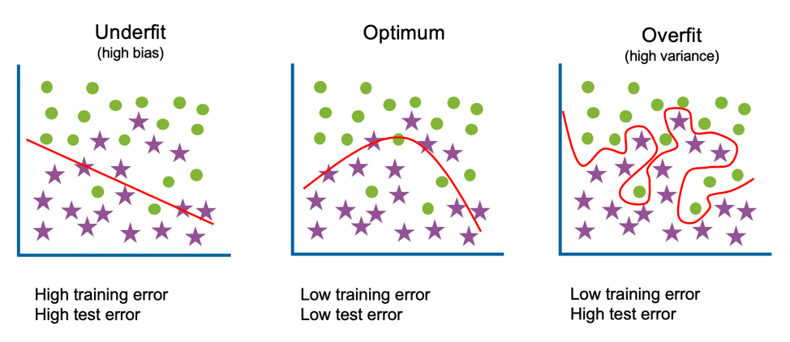

Different machine learning algorithms are searching for different trends and patterns. Consequently, one algorithm isn’t the best across all datasets or for all use-cases. To find the best solution, we conduct a lot of experiments, evaluating different machine learning algorithms and tuning their hyper-parameters. This chapter introduces various important topics:

* Train, Test & Validation Data
* Algorithm Exploration
* Hyper-parameter Optimization
* Ensembles

## Terminology

### Bias

Bias is the expected difference between the parameters of a model that perfectly fits your data and those your algorithm has learned. Low bias algorithms (Decision Trees, K-nearest Neighbors & Support Vector Machines) tend to find more complex patterns than high bias algorithms.

### Variance

This is how much the algorithm is impacted by the training data; how much the parameters change with new training data. Low variance algorithms (e.g. Linear Regression, Logistic Regression & Naive Bayes) tend to find less complex patterns than high variance algorithms.

### Underfitting

The model is too simple to capture the patterns within the data; this will perform poorly on data it has been trained on as well as unseen data. High bias, low variance. High training error and high test error.

### Overfitting

The model is too complicated or too specific, capturing trends that do not generalize; it will accurately predict data it has been trained on but not on unseen data. Low bias, high variance. Low training error and high test error.

 
### Bias-Variance Trade-off

The Bias-Variance Trade-off refers to finding a model with the right complexity, minimizing both the train and test error.

Further Reading: [Bias-Variance Tradeoff Infographic](https://elitedatascience.com/bias-variance-tradeoff)

## Train, Validation & Test

Machine learning algorithms learn from examples and, if you have good data, the more examples you provide, the better it will be at finding patterns in the data. However, you must be cautious of overfitting; overfitting is where a model can accurately make predictions for data it has been trained on but unable to generalize to data is hasn’t seen before.
This is why we split our data into training data, validation data and test data. Validation data and test data are often referred to interchangeably, however, they are described below as having distinct purposes.
Training data
This is the data used to train the model, to fit the model parameters. It will account for the largest proportion of data as you wish for the model to see as many examples as possible.

### Validation data

This is the data used to fit hyper-parameters and for feature selection. Although the model never sees this data during training, by selecting particular features or hyper-parameters based on this data, you are introducing bias and again risk overfitting.

### Test data

This is the data used to evaluate and compare your tuned models. As this data has not been seen during training nor tuning, it can provide insight into whether your models generalize well to unseen data.

### Cross-Validation

The purpose of cross-validation is to evaluate if a particular algorithm is suited for your data and use-case. It is also used for hyper-parameter tuning and feature selection.

The data is split into train and validation sets (though you should have some test data put to one side too) and a model built with each of the slices of data. The final evaluation of the algorithm is the average performance of each of the models.

#### Hold-out Method

The simplest version of cross-validation is the hold-out method where we randomly split our data into two sets, a training set and a validation set. This is the quickest method as it only requires building a model once. However, with only one validation data set, there is a risk that it contains particularly easy, or difficult, observations to predict. Consequently, we could find we are overfitting to this validation data and on a test set it would perform poorly.

#### K-fold Cross-Validation

The k-fold cross-validation method involves splitting the data into k-subsets. You then train a model k times, each time using one of the k-subsets as its validation data. The training data will be all other observations not in the validation set. Your final evaluation is the average across all k folds.

#### Leave-one-out cross-validation

This is the most extreme version of K-fold cross-validation, where your k is N (the number of observations in your dataset). You train a model N separate times using all data except for one observation and then validate its accuracy with its prediction for that observation. Although you are thorough evaluating how well this algorithm works with your data set, this method is expensive as it requires you to build N models.

#### Stratified cross-validation

Stratified cross-validation enforces that the k-fold sets have similar proportions of observations for each class in either categorical features or the label.

## Algorithm Exploration
	
The algorithms you explore should be driven by your use-case. By first identifying what you are trying to achieve, you can then narrow the scope of searching for solutions. Although not a complete list of possible methods, below are links that introduce algorithms for Regression, Classification, Clustering, Recommendations, and Anomaly Detection. A colleague and I also created this tool to help guide algorithm selection ([Click here to visit Algorithm Explorer](https://samrose3.github.io/algorithm-explorer/)).

### Regression

Regression algorithms are machine learning techniques for predicting continuous numerical values. They are supervised learning tasks which means they require labeled training examples.

Further reading: [Machine Learning: Trying to predict a numerical value](https://medium.com/@srnghn/machine-learning-trying-to-predict-a-numerical-value-8aafb9ad4d36)

### Classification

Classification algorithms are machine learning techniques for predicting which category the input data belongs to. They are supervised learning tasks which means they require labeled training examples.

Further reading: [Machine Learning: Trying to predict a classify your data](https://medium.com/@srnghn/machine-learning-trying-to-predict-a-categorical-outcome-6ba542b854f5)

### Clustering

Clustering algorithms are machine learning techniques to divide data into a number of groups where points in the groups have similar traits. They are unsupervised learning tasks and therefore do not require labeled training examples.

Further reading: [Machine Learning: Trying to discover structure in your data](https://medium.com/@srnghn/machine-learning-trying-to-discover-structure-in-your-data-2fbbc4f819ae)

### Recommendation Engines

Recommendation Engines are created to predict a preference or rating that indicates a user’s interest in an item/product. The algorithms used to create this system find similarities between either the users, the items, or both.

Further reading: [Machine Learning: Trying to make recommendations](https://medium.com/@srnghn/machine-learning-trying-to-make-recommendations-ea2912cf468)

### Anomaly Detection

Anomaly Detection is a technique used to identify unusual events or patterns that do not conform to expected behavior. Those identified are often referred to as anomalies or outliers.

Further reading: [Machine Learning: Trying to detect outliers or unusual behavior](https://medium.com/@srnghn/machine-learning-trying-to-detect-outliers-or-unusual-behavior-2d9f364334f9)

## Hyper-Parameter Optimization

Although the terms parameters and hyper-parameters are occasionally used interchangeably, we are going to distinguish between the two.

**Parameters** are properties the algorithm is learning during training.

*For linear regression, these are the weights and biases; whilst for random forests, these are the variables and thresholds at each node.*

**Hyper-parameters**, on the other hand, are properties that must be set before training.

*For k-means clustering, you must define the value of k; whilst for neural networks, an example is the learning rate.*

**Hyper-parameter optimization** is the process of finding the best possible values for these hyper-parameters to optimize your performance metric (e.g. highest accuracy, lowest RMSE, etc.). To do this, we train a model for different combinations of values and evaluate which find the best solution. Three methods used to search for the best combinations are Grid Search, Random Search, and Bayesian Optimization.

### Grid Search

You specify values for each hyper-parameter, and all combinations of those values will be evaluated.

For example, if you wish to evaluate hyper-parameters for random forest, you could specify provide three options for the number of trees hyper-parameter (10, 20 and 50) and for the maximum depth of each tree you also provide three options (no limit, 10 and 20). This would result in a random forest model being built for each of the 9 possible combinations: (10, no limit), (10, 10), (10, 20), (20, no limit), (20, 10), (20, 20), (50, no limit), (50, 10), and (50, 20). The combination that provides the best performance will be those you use for your final model.

* **Pros:** Simple to use. You will find the best combination of the values you’ve provided. You can run each of the experiments in parallel.

* **Cons:** Computationally expensive as so many models are being built. If a particular hyper-parameter is not important, you are exploring different possibilities unnecessarily.

### Random Search

You specify ranges or options for each hyper-parameter and random values of each are selected.

Continuing with the random forest example, you might provide the range for the number of trees to be between 10 and 50 and max_depth to be either no limit, 10 or 20. This time, rather than it compute all permutations, you can specify the number of iterations you wish to run. Say we only want five, then we might test something like (19, 20), (32 no limit), (40, no limit), (10, 20), (27, 10).

* **Pros:** Simple to use. More efficient and can outperform grid search when only a few hyper-parameters affect the overall performance. You can run each of the experiments in parallel.

* **Cons:** It involves random sampling so will only find the best combination if it searches that space.

### Coarse to Fine

For both grid search and random search, you can also use the coarse to fine technique. This involves exploring a broader range of variables with wide intervals or all possible options. Once you’ve got your results from this initial search you explore the results to see if there are any patterns or particular regions that look promising. If so, you can repeat the process but refine your search.

For the random forest example above, we might notice that results are promising when the maximum depth has no limit and when the number of trees hyper-parameter is either 10 or 20. The search process is repeated but keeping the maximum depth hyper-parameter constant and increasing the granularity of the number of tree options, testing values of 12, 14, 16, 18, to see if we can find a better result.

* **Pros:** Can find more optimized hyper-parameters, improving the performance metric.

* **Cons:** Evaluation of the results to find the best regions to explore can be cumbersome.

### Bayesian Optimization

Bayesian Optimization uses the prior knowledge of success with hyper-parameter combinations to choose the next best.

The technique uses a machine learning approach, building a model where the hyper-parameters are the features and the performance is the target variable. After each experiment, a new data point is added and a new model built.

It assumes similar combinations will have similar results and prioritize exploring regions where promising results have already been seen. However, it also takes into consideration uncertainty as a possibility for large gain; if there are large areas that have not yet been explored, it will also prioritize these as.

Taking just one hyper-parameter, the number of trees, the algorithm might first try 10 and get a pretty good performance. It then tries 32 and the performance is significantly better. Bayesian optimization builds a model based on the first two data points to predict performance. The model is likely to be linear with just the two data points so the next value chosen is 40, with the expectation that the performance will continue to improve as the number of trees increase. It does not. Now, it builds another model that suggests there might be improvement around 32 where it has seen the best result so far, however, there’s still a large gap between 10 and 32 that hasn’t been explored and due to large uncertainty, it chooses 21. Again, the model is tweaked with this new data and another value chosen… 

* **Pros:** Can find more optimized hyper-parameters, improving the performance metric. It can reduce the time spent searching for an optimum solution when the number of parameters is high and each experiment is computationally expensive.

* **Cons:** You cannot run each experiment in parallel as the next combination of hyper-parameter values is determined by the prior runs. It also requires tuning — choosing a scale for each hyper-parameter and an appropriate kernel.

## Ensemble Learning

Ensembles combine several machine learning models, each finding different patterns within the data, to provide a more accurate solution. These techniques can both improve performance, as they capture more trends, as well as reduce overfitting, as the final prediction is a consensus from many models.

### Bagging

Bagging (bootstrap aggregations) is the method of building multiple models in parallel and average their prediction as the final prediction. These models can be built with the same algorithm (i.e. the Random Forest algorithm builds many decision trees) or you can build different types of models (e.g. a Linear Regression model and an SVM model).

### Boosting

Boosting builds models sequentially evaluating the success of earlier models; the next model prioritizes learning trends for predicting examples that the current models perform poorly on. There are three common techniques for this: AdaBoost, Gradient Boosting and XGBoosted.

### Stacking

Stacking involves building multiple models and using their outputs as features into a final model. For example, your goal is to create a classifier and you build a KNN model as well as a Naïve Bayes model. Rather than choose between the two, you can pass their two predictions into a final Logistic Regression model. This final model may result in better results than the two intermediate models.
