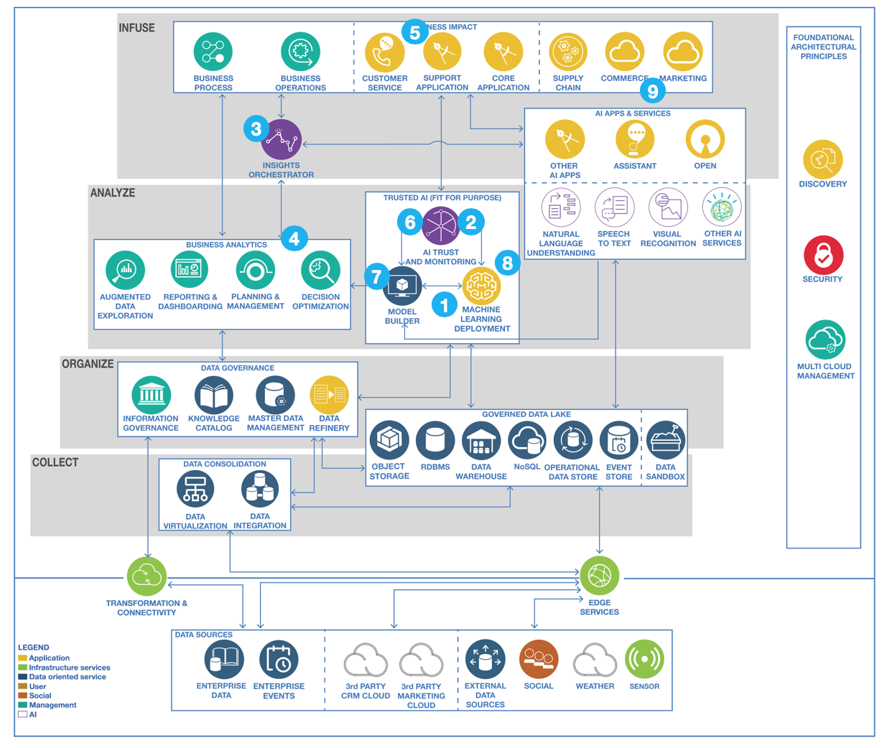

# Runtime architectures

## Intelligent application integrating ML service and bias monitoring

From the main reference architecture, the intelligent application is composed of multiple components working together to bring business agility and values:

1. The AI model is deployed as a service or as part of a real time analytics processing
1. Watson OpenScale is used to monitor runtime performance and fairness over the customer population.
1. The predictions are interpreted by an AI Insights Orchestrator deployed on IBM Cloud.
1. The orchestrator consults Decision Management or Optimization components for the next best action or offer to be provided to the customer.
1. This offer is communicated within the customer’s workflow by infusing it into the active customer care and support interactions, such as a Watson Assistant implementation.
1. Over some time period, Watson OpenScale detected the model has skewed against the real world data it’s encountering and needs to be retrained.
1. This triggers deeper analysis using Watson Studio of the divergence from the original model and similar steps to the original model design are taken to retrain the model with optimal features and new training data.
1. An updated performant model is deployed to Watson Machine Learning, as another turn of the iterative end to end model lifecycle governance.
1. Customers react favorably to the offers and the business starts to see the desired outcomes of lower customer churn and higher satisfaction ratings.

## Intelligent application with real time analytics

The generic reference architecture can be extended with a real time analytics view. The application solution includes components integrated with event streams to do real time analytics like a predictive scoring service, and event stream analytics.

The components involved in this diagram represents a typical cloud native application using different microservices and scoring function built around a model created by one or more Data Scientist using machine learning techniques. We address how to support the model creation in [this note](../model-dev/README.md). The top of a diagram defines the components of an intelligent web application:

* End user is an internal or external business user. It uses a single page application, or mobile application connected to a back-end to front end service.
* The back-end to front end service delivers data model for the user interface and perform service orchestration.
* As a cloud native app, and applying clear separation of concerns, we have different microservices, each being responsibles to have its own data source.  
* A scoring service, most likely a function as service, runs the model.
* The action to perform once the scoring is returned, is business rules intensif, so as best practice, we propose to externalize the rule execution within a decision service.

The lower part of the diagram illustrates real time analytics on event streams, and continuous data injection from event sources:

* The event sources could be IoT devices, or Edge computing in mist.
* A first level of data transformation can be performed at the edge level in the mist. This is an optional level. 
* A second level of data transformation, run in the fog, and publish events to an event backbone while also persisting data to a data repository for future analytics work.
* The event backbone is used for microservice to microservice communication, as a event sourcing capability, and support pub/sub protocol.
* One potential consumer of those events could be a streaming analytics apply a machine learning model on the event data. The action part of this streaming analytics component is to publish enriched events. Aggregates, count, any analytics computations can be done in real time. 
* The AI Analytics layer needs to include a component to assess the performance of the model, and for example ensure there is not strong devision on the accuracy or responses are not bias. 
* Finally, as we address data injection, there are patterns where the data transformation is done post event backbone to persist data in yet another format.

