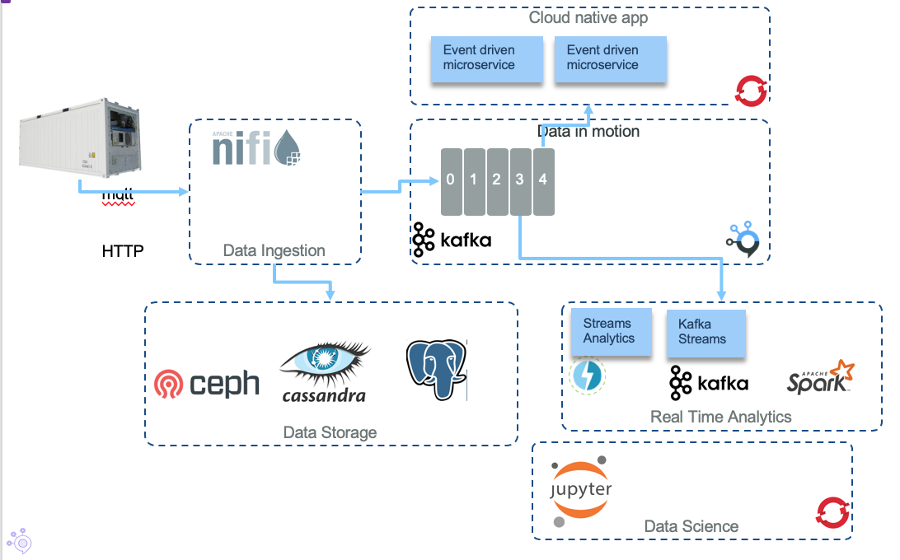

# Runtime architectures

## Intelligent application integrating ML service and bias monitoring

From the main reference architecture, the intelligent application is composed of multiple components working together to bring business agility and values:

1. The AI model is deployed as a service or running within a real time analytics processing application or embedded device.
1. An AI Orchestrator (e.g.Watson OpenScale) is used to monitor runtime performance and fairness over the customer population.
1. The predictions are interpreted by an AI Insights Orchestrator (e.g. deployed on IBM Cloud).
1. The orchestrator consults Decision Management or Optimization components for the next best action or offer to be provided to the customer.
1. This offer is communicated within the customer’s workflow by infusing it into the active customer care and support interactions, such as a personal assistant (e.g. Watson Assistant) implementation.
2. Over some time period, the AI Orchestrator detects model skew and needs to be retrained.
3. This triggers deeper analysis using, ML Workbench (e.g. Watson Studio), of the divergence from the original model and similar steps to the original model design are taken to retrain the model with optimal features and new training data.
4. An updated, better performing model is deployed to the model serving component (e.g. Watson Machine Learning), as another turn of the iterative end to end model lifecycle governance.
5. Customers react favorably to the offers and the business starts to see the desired outcomes of lower customer churn and higher satisfaction ratings.

## Intelligent application with real time analytics

The generic reference architecture can be extended with a real time analytics view. The application solution includes components integrated with event streams to do real time analytics like a predictive scoring service, and event stream analytics.

The components involved in this diagram represents a typical cloud native application using different microservices and scoring function built around a model created by one or more Data Scientist using machine learning techniques. We address how to support the model creation in [this note](../model-dev/README.md). The top of a diagram defines the components of an intelligent web application:

* End user is an internal or external business user. It uses a single page application, or mobile application connected to a back-end to front end service.
* The back-end to front end service delivers data model for the user interface and perform service orchestration.
* As a cloud native app, and applying clear separation of concerns, we have different microservices, each being responsible to have its own data source.  
* Either a scoring service (e.g. function as service or model serving component) runs the model or the model is embedded directly into the streaming engine (e.g. same process space)
* The action to perform once the scoring is returned, is business rules intensive, so as best practice, we propose to externalize the rule execution within a decision service.

The lower part of the diagram illustrates real time analytics on event streams, and continuous data injection from event sources:

* Typical event sources include:
  *  IoT devices
  *  Trade / Financial Data
  *  Weather Data
* In an Edge/Fog computing screnario first aggregations and transformations can be done on the edge 
* A second level of data transformation, run in the fog, and publish events to an event backbone while also persisting data to a data repository for future analytics work.
* The event backbone is used for microservice to microservice communication, as a event sourcing capability, and support pub/sub protocol.
* One potential consumer of those events could be a streaming analytics engine training/applying machine learning models on the event stream. The action part of this streaming analytics component is to publish enriched events. Aggregates, count, any analytics computations can be done in real time. 
* The AI Analytics layer needs to include a component to assess the performance of the model, and for example ensure there is no strong deviation on the accuracy and responses are not biased. 
* Finally, as we address data injection, there are patterns where the data transformation is done post event backbone to persist data in yet another format.

One specific architecture pattern used in the Reefer shipment reference implementation looks like this:

The Reefer container, acting as IoT device, emits container metrics every minute via the MQTT protocol. The first component receiving those messages is Apache Nifi to transform the messages to kafka events. Kafka is used as the event backbone and event source so microservices, deployed on a container orchestrator (e.g. RedHat OpenShift), can consume and publish messages. 

For persistence reasons, we may leverage big data types of storage like Cassandra to persist the container metrics over a longer time period. This datasource is used for the Data Scientists to do its data preparation and build training and test sets. 

Data scientists can run a ML Worbench (e.g. Watson Studio on IBM Cloud or Jupyter Lab on OpenShift) and build a model to be deployed as python microservice, to consume kafka events. A potential action is triggering a notification to put the Reefer container into maintenance.
