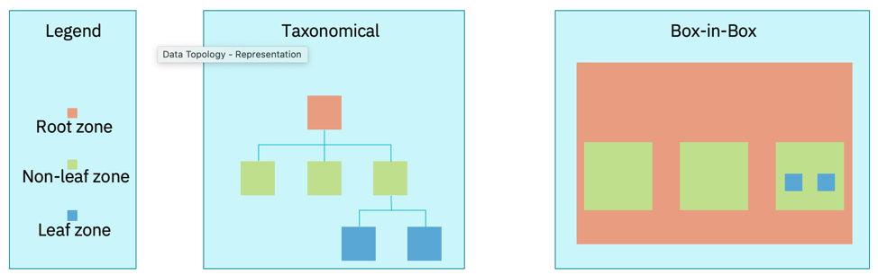

# Data Topology
A data topology is an approach for classifying and managing real-world data scenarios, which may  cover any aspect of a business: operational, accounting, regulatory and compliance, reporting, advanced analytics, etc. A well formed data topology is an essential foundation for any organization wanting to succeed with analytics, the data topology can provide a path forward to help manage any type of analytic, from business insights to AI,  for any use in any type of enterprise.

## Core elements of a Data Topology

There are three Core elements of a data topology:

•	Zone Map
•	Data Flow
•	Data Layer

### Zone Map

*Zones* are representative of something which can be used for grouping/clustering or with a instantiation/deployment of data (whether that data is transient or persistent in nature).
Zones are inherently abstract and conceptual in nature as a zone is not a deployed object.

A  *Zone Map* identifies and names each zone.

Figure 1 shows the primitive zones that are used in a zone map.

It is only a leaf zone that is associated with the instantiation of data. Non-primitive zones include a virtual zone that may cluster multiple zones together and reflect groups for data virtualization or data federation.

The data flow helps to illustrate the points of integration or interoperability between the zones. When circular data flows occur across the zones, this can become a flag for investigation as data integrity may potentially be compromised if not well managed (designed and governed).

The data layer is reflective of a cloud, fog, mist topology where data can be highly distributed across an organization and certainly across an enterprise. A common aspect across any cloud, fog, and mist node is that each will have compute power, storage capabilities, and network connectivity.

Mixed deployment data layers include:
•	Cloud:	e.g., public cloud provider
•	Fog:	e.g., an on prem private cloud
•	Mist	e.g., a smart device
